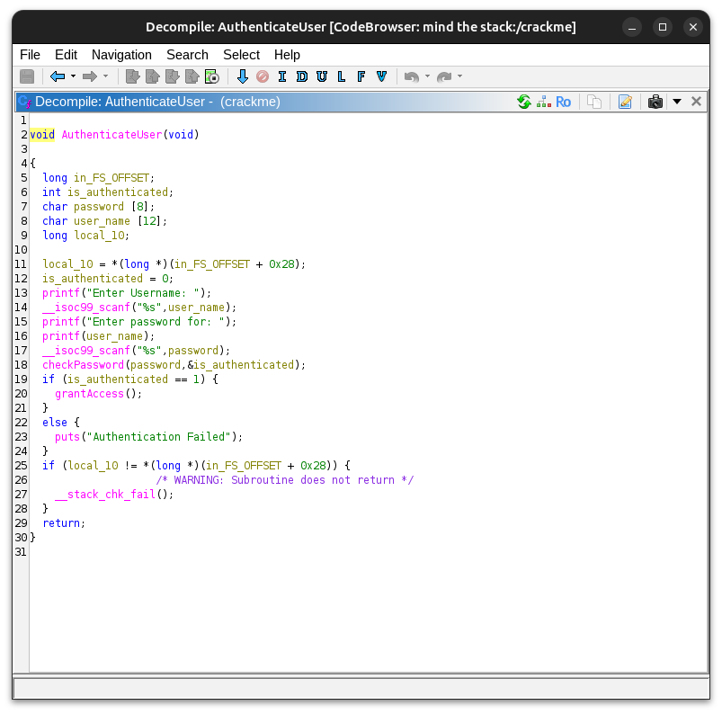
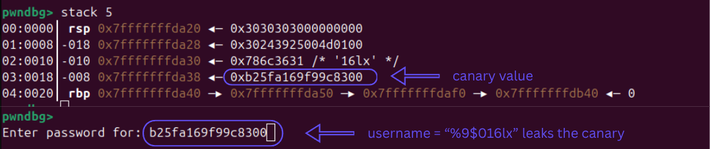

# Vulnerability Research & Exploitation: Bypassing Stack Canaries via Format String and Buffer Overflow

## 1. Executive Summary

This report details the vulnerability analysis and subsequent exploitation of a compiled Linux binary (`crackme`). The objective was to alter the program's control flow to bypass the authentication mechanism.

The analysis revealed two primary vulnerabilities within the `authenticator` function: an unbounded input reading leading to a Buffer Overflow, and a Format String vulnerability. Despite the presence of Stack Canaries and a non-executable stack (NX), the vulnerabilities were chained together. The Format String flaw was utilized to leak the dynamic Stack Canary during runtime, allowing the construction of a tailored payload that bypassed the mitigation and successfully redirected the instruction pointer to an unreferenced function, `grantAccess()`.

## 2. Static Analysis & Reconnaissance

The initial phase involved identifying the binary's properties and the security mitigations compiled into it.

### 2.1 Mitigation Posture

Using standard reconnaissance tools, the binary's defenses were evaluated:

* **Stack Canary:** Enabled
* **NX (No-Execute):** Enabled (Stack is not executable)
* **PIE (Position Independent Executable):** Disabled (Base address is fixed at `0x400000`)
* **RELRO:** Partial RELRO (The Global Offset Table (GOT) is writable)

### 2.2 Vulnerability Identification

Decompiling the binary using Ghidra exposed the internal logic of the `authenticator` function. Two critical flaws were identified:

* **Buffer Overflow:** The program allocates fixed-size buffers for user input (`username` - 12 bytes, `password` - 8 bytes) but fails to validate the input length before copying data into them.
* **Format String Vulnerability:** The `printf` function is called directly on the user-controlled `username` variable (`printf(username)`) without a format specifier (e.g., `%s`).



### 2.3 Memory Layout Analysis

By analyzing the assembly instructions, the stack frame layout within the `authenticator` function was mapped:

* `username` array is located at `RBP - 0x14`.
* `password` array is located at `RBP - 0x1c`.
* The `is_authenticated` flag is located at `RBP - 0x20`.

Initial attempts focused on overflowing the `password` buffer to overwrite the `is_authenticated` flag. However, due to the stack growth direction, this approach was geometrically impossible without overwriting critical stack components. Overwriting the GOT was also ruled out because the target function was statically compiled.

The viable attack vector shifted to overwriting the Return Address (RIP) to jump directly to the `grantAccess()` function located at `0x401905`.

## 3. Dynamic Analysis & Exploitation Strategy

To overwrite the return address, the Stack Canary must be preserved; otherwise, the program will terminate with a `*** stack smashing detected ***` error.

### 3.1 Information Leak (The Format String Attack)

The format string vulnerability was exploited to read values from the stack and leak the Canary. By injecting format specifiers (e.g., `%x`, `%p`, `%lx`) as the `username`, memory addresses on the stack were exposed.

Through dynamic debugging with `gdb` (`pwndbg`), the offset of the Canary relative to the `printf` call was determined.



It was established that the Canary resides at offset 9. Therefore, the payload `%9$016lx` was crafted to specifically leak the 64-bit Canary value in hexadecimal format.

### 3.2 Payload Construction

With the ability to leak the Canary dynamically, the exploitation strategy was formalized:

1. **Leak Phase:** Send `%9$016lx` as the username.
2. **Parse Phase:** Read the application's output, extract the leaked hexadecimal string, and convert it to an integer.
3. **Exploit Phase:** Construct the final payload for the password prompt.

**Stack Layout for Payload:**

| Component | Size (Bytes) | Description |
| --- | --- | --- |
| Padding | 20 | Fills the password and username buffers up to the Canary. |
| Canary | 8 | The leaked Canary value (to bypass the check). |
| Padding (RBP) | 8 | Fills the saved Base Pointer. |
| Return Address | 8 | The address of `grantAccess()` (`0x401905`). |

### 3.3 Handling Bad Characters

During testing, it was observed that certain characters within the payload (specifically whitespace characters like space, newline, tab: `\x20`, `\x0a`, `\x09`, `\x0d`, `\x0b`, `\x0c`) prematurely terminated the `scanf` input reading.

If the dynamically generated Canary contained any of these "bad chars", the payload injection would fail. To mitigate this, logic was implemented in the exploit script to check the leaked Canary. If bad characters are detected, the connection is dropped, and the exploit restarts, relying on the randomized nature of the Canary to eventually generate a "clean" value.

## 4. Exploit Implementation

The following Python script utilizes the `pwntools` library to automate the exploitation process.

```python
from pwn import *

leak_canary = b'%9$016lx' # Format string to leak the canary
grantAccess_addr = 0x401905
bad_chars = b'\x20\x0a\x09\x0d\x0b\x0c'

while True:
    # Start the crackme process
    p = process('./crackme', stdin=PTY, stdout=PTY)

    # Trigger Format String to leak the Canary
    p.recvuntil(b'Enter Username: ')
    p.sendline(leak_canary) 
    p.recvuntil(b'Enter password for: ')

    canary_hex = p.recv(16) # Read the leaked canary
    canary = int(canary_hex, 16)
    print(f"[*] Leaked canary = 0x{canary_hex.decode()}")

    # Verify Canary does not contain Bad Characters
    char_bytes = p64(canary)
    if any(char in char_bytes for char in bad_chars):
        print("[-] Leaked canary contains bad characters. Retrying...")
        p.close()
        continue

    # Build the Payload
    payload = b'A' * 20                 # Padding to reach the Canary
    payload += p64(canary)              # Inject the valid Canary
    payload += b'B' * 8                 # Padding to overwrite RBP
    payload += p64(grantAccess_addr)    # Overwrite Return Address (RIP)

    print(f"[*] Sending payload = {payload.hex()}")

    # Inject the payload
    p.sendline(payload)

    # Interact with the shell/function
    print(p.recvall(timeout=1).decode(errors='ignore'))
    break
```

## 5. Remediation

To secure the binary against these attacks, two fundamental coding practices must be enforced:

* **Format String Fix:** Never pass user-controlled input directly as the first argument to `printf`. The call should be modified to: `printf("%s", username);`.
* **Buffer Overflow Fix:** Replace unsafe functions like `gets` or `strcpy` with bounds-checking alternatives like `fgets(username, sizeof(username), stdin);`.